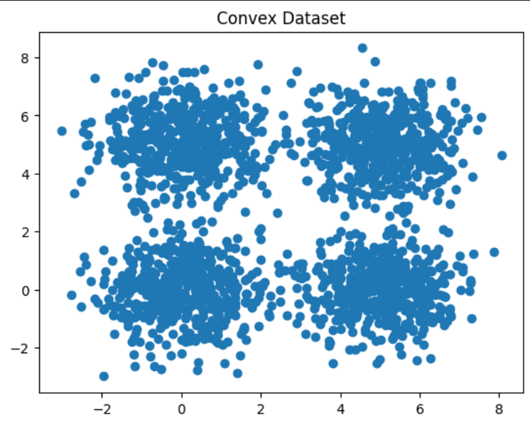
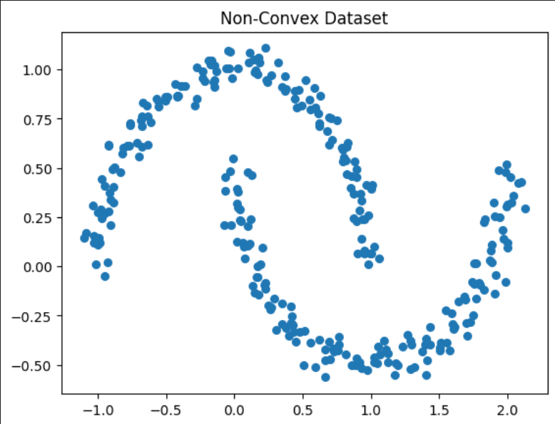
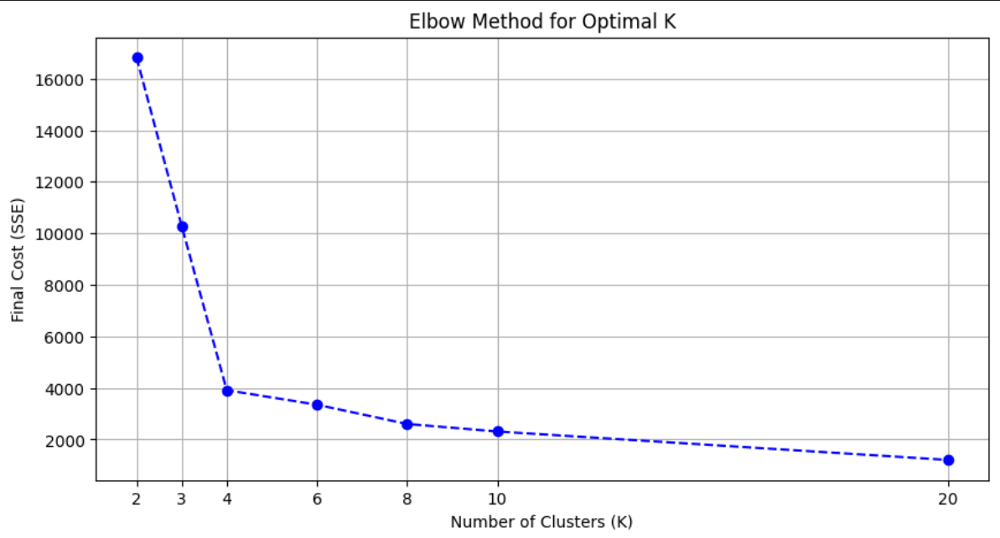
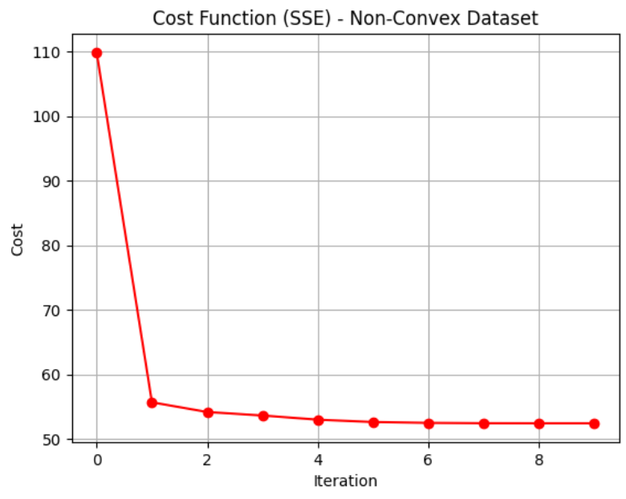

# KMeans Clustering Analysis 📍
📊 Comparative analysis of K-means clustering on convex vs. non-convex datasets, demonstrating algorithm performance on Gaussian blobs and interlaced moon-shaped distributions


## Table of Contents  

1. [About](#about)  
2. [Features](#features)  
3. [Requirements](#requirements)  
4. [Installation](#installation)  
5. [Usage](#usage)  

---

## About

The **K-Means Clustering Analysis** project is a comprehensive exploration of unsupervised learning, focusing on one of the most popular clustering algorithms. 

Built entirely from scratch using **NumPy**, this project implements the K-Means algorithm without the aid of high-level machine learning libraries. The primary goal is to demonstrate the internal mechanics of the algorithm—including centroid initialization, iterative point assignment, and convergence through cost minimization.

The project features a comparative study between two distinct types of data distributions:
1.  **Convex Clusters (Gaussian Blobs)**: Where K-Means performs optimally due to the spherical nature of the data. 
2.  **Non-Convex Clusters (Moons)**: Where the algorithm's inherent limitations are revealed, failing to capture complex, non-linear shapes. 

By visualizing the algorithm's progress at every iteration, this project serves as both a practical implementation and an educational tool for understanding geometric data partitioning.

---
## Features

- **From-Scratch K-Means Implementation**: A robust clustering algorithm built entirely with NumPy, featuring custom logic for centroid updates and point assignments.
- **Iterative History Tracking**: Detailed logging of labels and centroid positions at every step, allowing for a frame-by-frame analysis of the convergence process.
- **Cost Function Optimization**: Integrated Sum of Squared Errors (SSE) calculation (Inertia) to monitor and visualize how the algorithm minimizes intra-cluster variance.
- **Smart Convergence Detection**: Automated stopping criteria that detects when cluster assignments have stabilized, preventing unnecessary computations.
- **Dynamic Visualization Suite**: Custom plotting functions that display the evolution of clusters and centroids, providing a clear view of the Voronoi partitioning in action.
- **Geometric Robustness Testing**: A comparative framework that evaluates performance on both convex (spherical) and non-convex (interlaced) datasets to highlight algorithmic strengths and weaknesses.

---
## Requirements

- **Python 3.x**: The core programming language used for the project.  
- **Jupyter Notebook environment**: VS Code (with Jupyter extension), JupyterLab, or Google Colab to run the `.ipynb` file.  
- **NumPy**: For efficient numerical computations and matrix operations.  
- **Scikit-Learn**: Specifically used for fetching the MNIST dataset and splitting the data.
- **Matplotlib**: For generating graphs and visualizing the non-linear decision boundaries.  
- **Git**: To clone the repository.


---
## Installation

### 1. Clone the repository
```bash
git clone https://github.com/Amit-Bruhim/KMeans-Clustering-Analysis.git
```

### 2. Navigate into the project folder
```bash
cd KMeans-Clustering-Analysis
```

### 3. Install required libraries
```bash
pip install numpy scikit-learn matplotlib
```

### 4. Open and Run the Notebook
Open the file `src/KMeans-Clustering-Analysis.ipynb` using VS Code or upload it to Google Colab.  

You can then click **"Run All"** to execute the training and see the results.

*Tip: You don't have to run the code to see the results; you can simply scroll through the notebook to view the pre-saved outputs and graphs.*


---
## Usage

### 1. Data Exploration and Visualization
The project starts by generating and visualizing two distinct types of synthetic datasets to test the algorithm's boundaries: a convex dataset (Gaussian blobs) and a non-convex dataset (interlaced moons).




### 2. Determining Optimal K (The Elbow Method)
Before clustering, we use the Elbow Method to find the optimal number of clusters (K). By plotting the Sum of Squared Errors (SSE) against different values of K, we identify the "elbow" point where adding more clusters yields diminishing returns in error reduction.



### 3. Iterative Training Process
The core of the project is the step-by-step visualization of the K-Means algorithm. We track how centroids migrate from their random initial positions to the centers of the data density.

Since the training involves multiple iterations, the following video demonstrates the dynamic movement of centroids and the reassignment of labels in real-time:


### 4. Cost Analysis (SSE)
We monitor the algorithm's convergence by plotting the cost function over time. The SSE consistently decreases and plateaus as the centroids stabilize. 

*Example: SSE reduction over iterations for the Moon dataset:*



### 5. Final Results and Comparison
The final stage compares the algorithm's performance on both datasets. While K-Means successfully partitions the convex data, the visualization clearly shows its limitation in handling the non-linear boundaries of the moon-shaped data.


